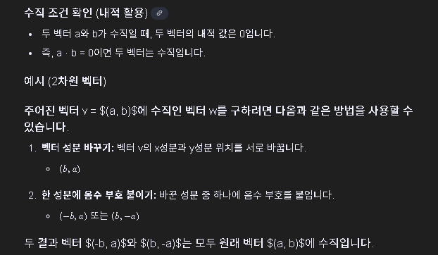

## 수직 벡터

```csharp
public void shootFunction(float Speed, Vector3 dir)
    {
        mySpeed = Speed;
        SetPrice((int)mySpeed);
        Debug.Log("Falling object cur_price: " + price);
        myRigid.AddForce(Vector3.up * UpSpeed * (mySpeed + 2), ForceMode.Impulse);
        myRigid.AddForce(dir * -BackSpeed * (mySpeed + 1), ForceMode.Impulse);

        Vector3 torqueAxis = new Vector3(dir.z, 0, -dir.x).normalized;
        myRigid.AddTorque(torqueAxis * (mySpeed + 1), ForceMode.Impulse);

        isbeingShot = true;
    }
```

처음 게임을 구상할 때는 플레이어의 rotation을 변경하지 못하게 하려고 했는데, 나중에서야 움직이는 방향에 맞춰서 바라보도록 하는 편이 몰입감에 더 좋을 것 같다고 생각하게되었다.

그러고 나니 회전 속도를 주는 코드의 회전 축을 추가로 구해줘야 한다는 것을 깨닫게 되었다.(기존 코드에서는 방향이 고정되어 있으니 회전축도 고정되어 있었다)

그때 수직 벡터를 구하는 공식을 떠올리게 되었다. 


처음에는 내적이 바로 떠올랐지만, 방정식 풀이는 간단하지만 코드로 구현하는건 매우 귀찮고 비효율적일 것 같아서 기각했다.

그래서 결국  a*b = 0이면 두 벡터는 수직이라는 성질을 활용하였다.

고민은 길었지만 구현은 매우 쉽고 간단했다. x와 z 벡터값을 바꿔주고, 하나의 값에 -만 붙여주면 됐다.

옛날에 고등학생 시절에 기하를 배우면서 게임에 직접 구현해보고, 이 과정을 정리해서 수행평가 제출을 했던 기억이 떠오르면서 감회가 새로웠다.

이제는 대학생이 되어서 더 어려운 수학 개념들을 배우고 있는데, 몇 년 후에 또다시 이런 기분을 느끼면서 그 공식들을 활용해서 코딩하고 있을지도 모르겠다